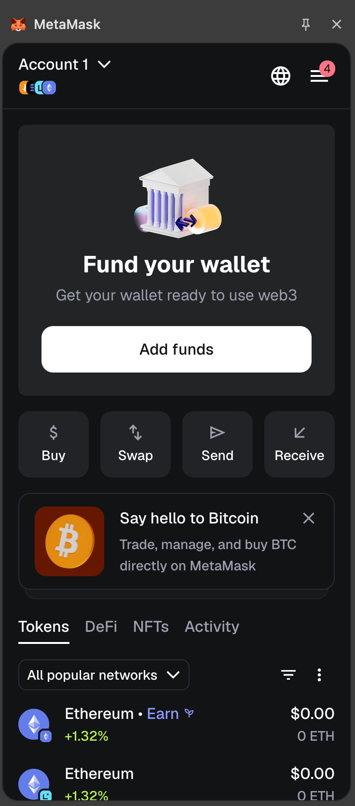
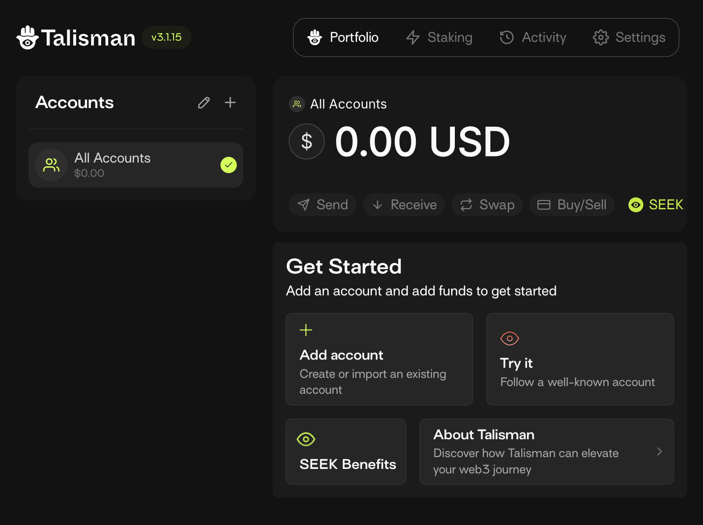
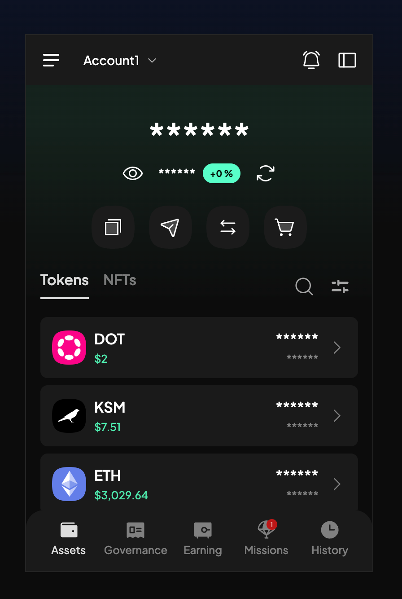
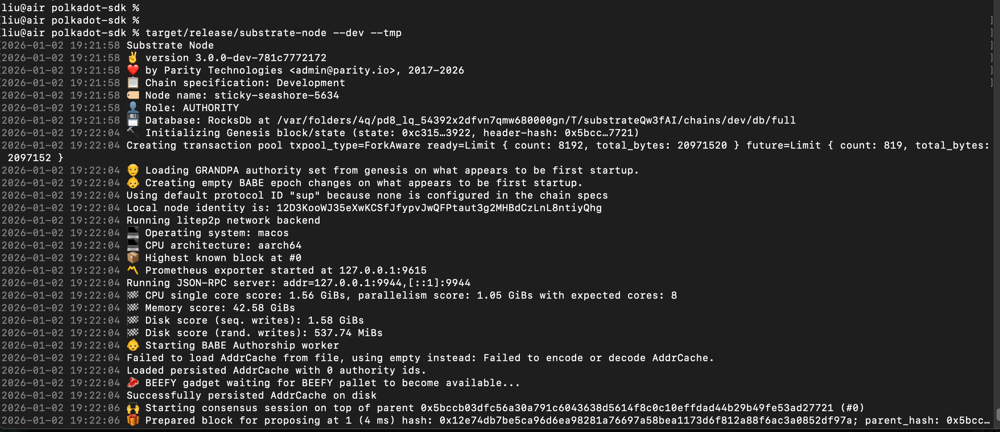
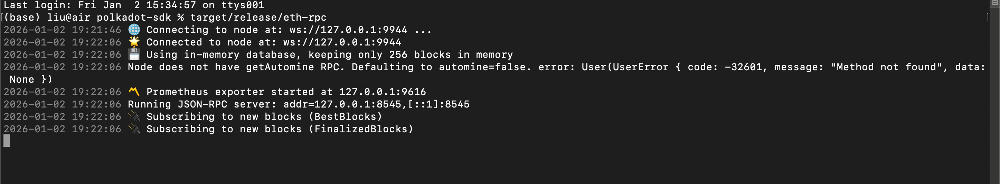
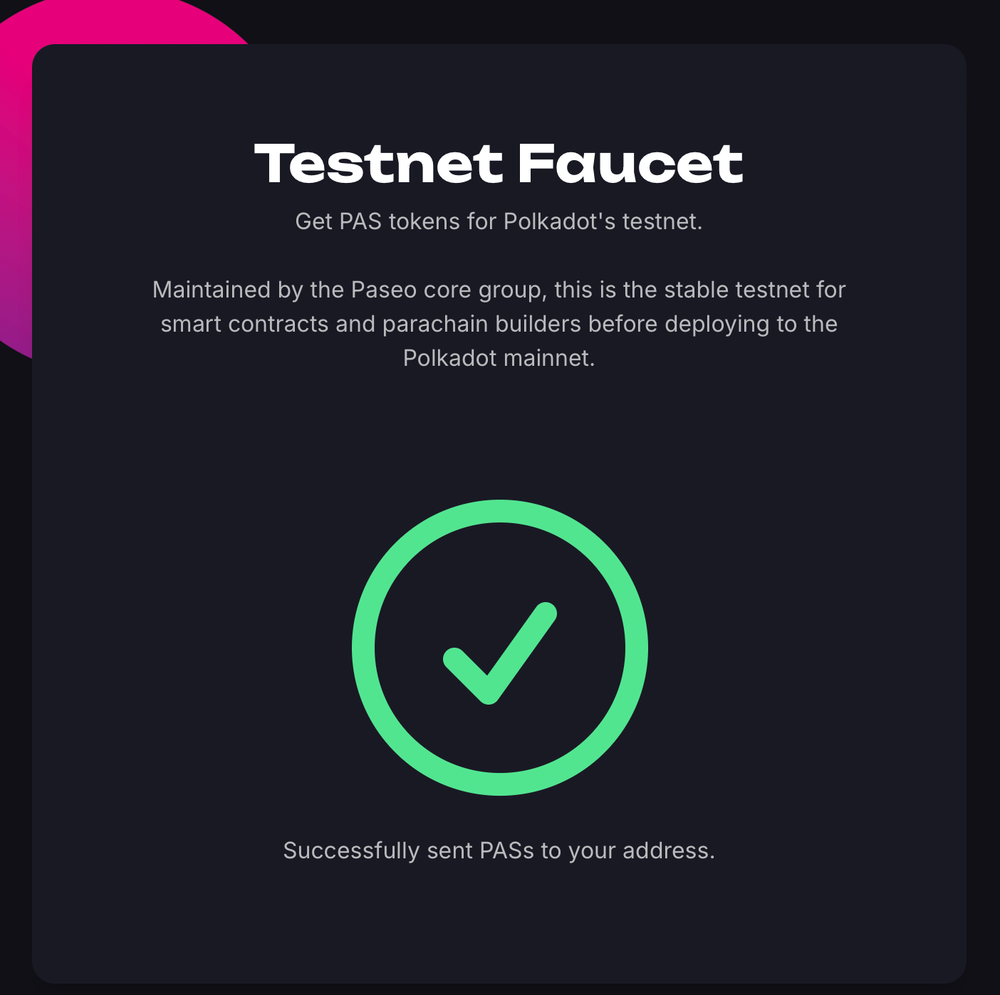
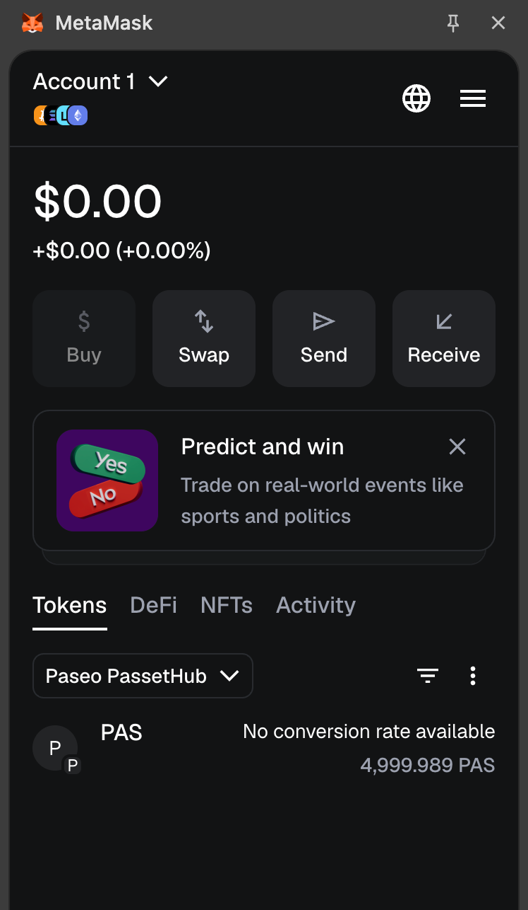
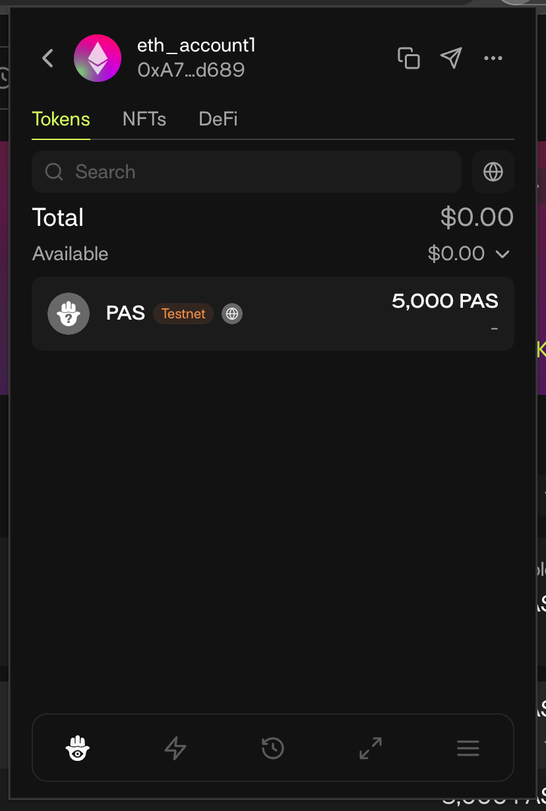
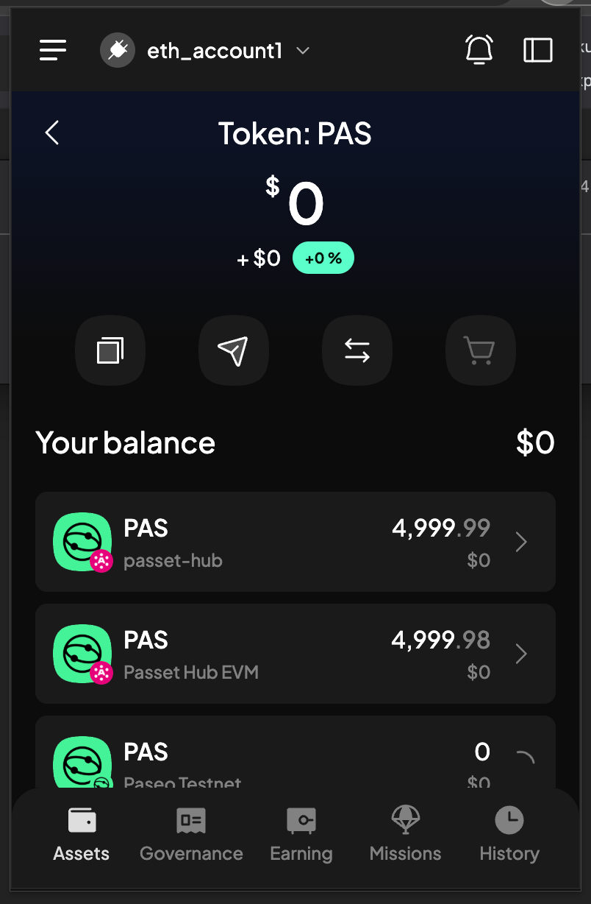
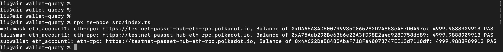

# Student 1951 - Lesson 1 Submission

This folder contains screenshots of the completed work for Lesson 1 from liumeng.


---------------------------------

## 1. 安装三种不同的钱包，创建测试账户。

### 1.1 MetaMask

> Ethereum: 0xDAA5A34D500799935C065282D24853e467D0497c



### 1.2 Talisman

> Ethereum: 0xA75Aab290Be63b6e22A3fD98E2a4d928D758d689



### 1.3 SubWallet

> Ethereum: 0x4A622DaB8485AbaF718Fa40073747EE13d7110df

> Paseo testnet: 15qdkk1xcCxFwC9xB1BN436cDxUQ8pM3m2GKRfG1VnbxmRJF



**attention: 尽量创建eth account，方便后续学习和操作！**


---------------------------------

## 2. 本地编译Polkadot SDK，启动节点和RPC服务

- 编译：
	- cargo build --release -p pallet-revive-eth-rpc
	- cargo build --release --bin substrate-node
- 启动：
	- target/release/substrate-node --dev --tmp
	- target/release/eth-rpc






---------------------------------

## 3. https://faucet.polkadot.io/?parachain=1110 得到测试token



### 3.0 select network & chain:
in faucet page, always select network & chain(by default):
    1. Network: Polkadot testnet (Paseo)
    2. Chain: Passet Hub: smart contracts

### 3.1 metamask wallet 领取testnet token:
    1. add network & chain: metamask - network - Add a custom network
        - Network name: Paseo PassetHub
        - Default RPC URL: https://testnet-passet-hub-eth-rpc.polkadot.io
        - Chain ID: 420420422
        - Currency symbol: PAS

    2. require token in faucet page:
        1. Network: Polkadot testnet (Paseo)
        2. Chain: Passet Hub: smart contracts
        3. paste Ethereum address into Paseo Address input box
        4. click "Get some PASs"

    3. check balance in metamask ( a moment later ): Tokens: 4,999.989 




### 3.2 talisman wallet 领取testnet token:

receive - network - paseo / Paseo Asset Hub - copy address - 到上述水龙头获取testnet token

talisman中不显示该token余额，因为创建的account是polkadot的

把talisman钱包的助记词导入metamask，选择新导入的wallet - receive - network选择刚才添加的testnet - 复制地址，到上述水龙头获取testnet token，可以查询到Tokens: 4,999.989 PAS

又在talisman创建一个eth account:eth_account1此时可以看到余额了：5000 PAS

eth_account1: 0xA75Aab290Be63b6e22A3fD98E2a4d928D758d689

在线查询： https://paseo.subscan.io/

输入地址，查询结果最底部有一条信息：Crosschain Transfer (1)

可以查询到Tokens: 4,999.989 PAS





### 3.3 subwallet wallet 领取testnet token:

got address - paseo testnet - copy address - 到上述水龙头获取testnet token

但是subwallet不显示，需要添加token: PAS，等一会儿就显示了

在线查询： https://paseo.subscan.io/

输入地址，查询结果最底部有一条信息：Crosschain Transfer (1)

可以查询到Tokens: 4,999.989 PAS




---------------------------------

## 4. 分别在钱包中和运行程序 [https://github.com/papermoonio/2026-h1-building-production-grade-dApps/blob/main/course/lesson-1/src/index.ts](https://github.com/papermoonio/2026-h1-building-production-grade-dApps/blob/main/course/lesson-1/src/index.ts) 确认token领取成功

结果截图通过PR提交到  https://github.com/papermoonio/2026-h1-building-production-grade-dApps/tree/main/homework/lesson-1


### 4.1 通过钱包工具代码获取账户余额
    - 通过metamask获取账户余额
    - 通过talisman获取账户余额
    - 通过subwallet获取账户余额


### 4.2 通过typescript代码获取账户余额
	- npm init -y
     npm install ethers @polkadot/api
	- npm install -D typescript ts-node @types/node
	- src/index.ts
        - 代码里testnet rpc-url要和钱包的testnet rpc-url一样：see: 4.3
		- 修改钱包地址 & 不同的钱包地址需要对应的处理逻辑：see: 4.3
	- npx ts-node src/index.ts




### 4.3 注意事项

#### 4.3.1 testnet network & chain必须匹配
三者必须一致：
    - 从wallet中copy的address所在的network & chain
    - 在faucet领水时选择的network & chain
    - 本地代码查询余额时，使用的rpc-url

```javascript
    //选择和testnet对应的rpc-url
    // faucet https://faucet.polkadot.io/ Paseo AssetHub
    const URL = "https://services.polkadothub-rpc.com/testnet";

    // faucet https://faucet.polkadot.io/ Paseo Passet Hub: smart contracts
    //const URL = "https://testnet-passet-hub-eth-rpc.polkadot.io";
```

#### 4.3.2 不同的address对应不同的处理逻辑

这里有两种地址格式，注意看清楚是eth account address还是substrate account address

- metamask 默认提供的是eth account address，和substrate address的不同
- subwallet 和 talisman :
    - 创建账户时选择eth account，那么账户和metamask提供的eth account address一样
    - 创建账户时选择polkadot account，那么账户和metamask提供的eth account address不一样，属于substrate account address

- The Polkadot Faucet at faucet.polkadot.io often requires a Substrate (SS58) address, but MetaMask gives you an Ethereum (H160) address (starting with 0x).

- Since you are working with pallet-revive (the new EVM-compatible layer for Polkadot), you actually have two ways to query balances: the Ethereum way (for MetaMask) and the Substrate way (for SubWallet/Talisman).


#### 4.3.3 用任何一种钱包，创建account的时候，尽量选择eth account


---------------------------------

